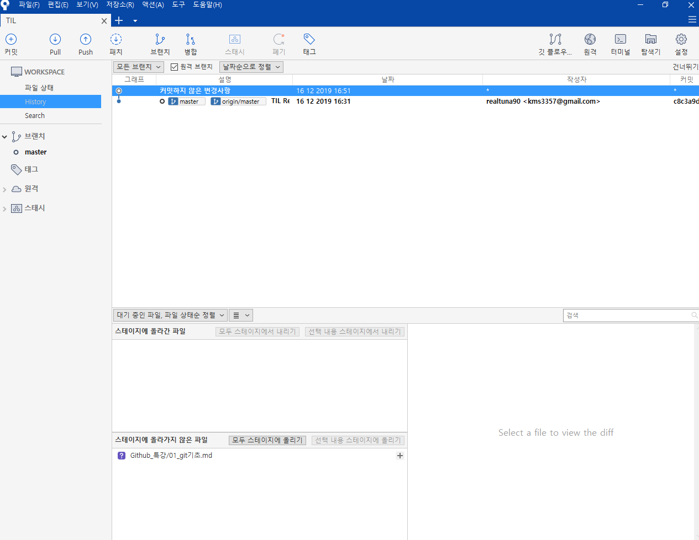
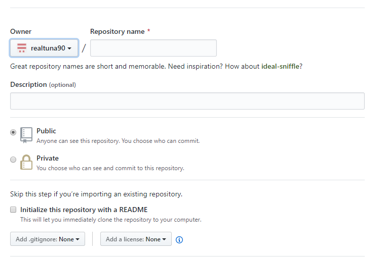
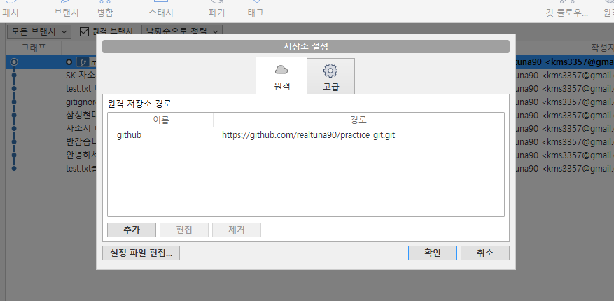
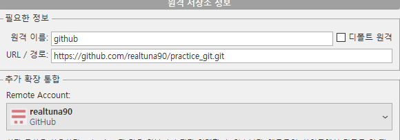
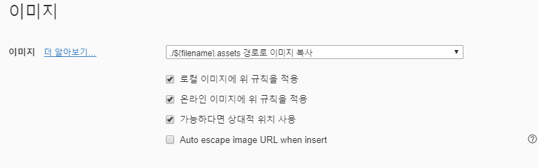

# Git 기초

## 들어가기 앞서

### MOOC*(Massive Open Online Course*)

Coursera : Deep learning.AI,

edX : introduction to Computer Science, CS50x

Udacity : android, Unity 등

K-Mooc : 한국식

Udemy : VPN 으로 미국에서 접속해야 속도가 잘나옴

## 개념

### SCM이란?

Source Code Manager의 약자로, 소스 코드의 버전을 정리하기 위해 존재한다

### Git

현재 가장 많이 사용되는 SCM

- 개발자들의 구글드라이브?

- 개발자들의 이력서, 메모장

### Github

Git이 관리하는 Repo의 원격 저장소를 제공하는 서비스다. 가장 많이 사용하며, 오픈소스 프로젝트들이 성장하는 곳이다.

**GitHUB를 잘쓰려면**

- 오픈소스 컨트리뷰션

-  미니프로젝트

-  불편한 것들을 프로그래밍으로 해결하여 올려보자


## Github 시작 - 소스트리 사용

- 폴더 -> 디렉토리(Directory)

- Git달린 폴더 -> Repo(Repository)

-  폴더를 Repository로 추가

**=  추가 전에 보이면 안되는 파일목록 .gitignore 먼저 만들고 -> 파일명.확장자**

**= 관련 프로그램 입력하면 자동으로 gitignore 생성**

[](http://gitignore.io/)[**gitignore.io**Create useful .gitignore files for your projectgitignore.io](http://gitignore.io/)

= 폴더에서 우클릭 git bash

= git config --global user.name 이름

= git config --global user.email 이메일주소

= git add 디렉토리파일명

= git commit

\- 소스트리에서는 CREATE 경로 Repo 이름, Git으로 Repo 생성시 자동으로 Init


### 소스트리(SourceTree)

GUI 로 표현되는 SCM 중 하나



### 파일 업로드 단계

1. GitHub 에 Remote Repo를 판다

- Github에서 new Repo

[](https://blog.naver.com/PostView.nhn?blogId=kmin3357&Redirect=View&logNo=221738954167&categoryNo=1&isAfterWrite=true#)

- 설정 -> 추가 -> 원격이름, GitHub Repo URL, Remote Account : GitHub ID -> 확인

[](https://blog.naver.com/PostView.nhn?blogId=kmin3357&Redirect=View&logNo=221738954167&categoryNo=1&isAfterWrite=true#)

2. 로컬과 Remote Repo를 잇는다

[](https://blog.naver.com/PostView.nhn?blogId=kmin3357&Redirect=View&logNo=221738954167&categoryNo=1&isAfterWrite=true#)

 

3. 로컬에서 Repo로 파일을 보낸다

- PUSH한다

- PUSH 할 때 심사숙고 - 업로드시 불필요한 파일이나 잘못 수정한 점이 없는지 꼭 확인된 것을 올려야한다

### README.md 파일 작성

- Typora 활용

  [](https://blog.naver.com/PostView.nhn?blogId=kmin3357&Redirect=View&logNo=221738954167&categoryNo=1&isAfterWrite=true#)

  클립보드 복사를 통해 이미지를 붙여넣기 위해 환경설정 수정

  - \# 1티어 \## 2티어 \##.... 계층구조 나누기 위해 사용

  - \| 파이프로 나누면 표가 생성됨

  - 소스코드 추가 시 \``사용

  - \``` 사용하면 사용 언어 선택 후 소스코드 작성 가능

