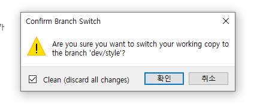
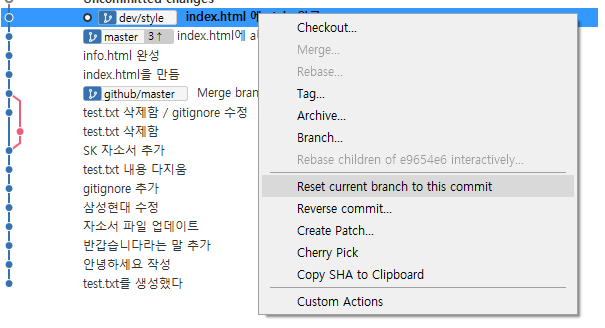

# Git 중급

## 협업

### **Clone**

- remote repo를 다른 장소에서 연결하는 일

### **Pull**

- remote repo와 싱크를 맞추기 위해서 하는 일

### **Add, Commit, Push**

- 다른 장소에서 작업한 내용을 Remote repo와 싱크를 맞춤



### **콜라보레이터**

- Github의 Remote Repo 설정에서 collaborators 추가

### **Conflict**

1. 두 사람이 서로 다른 파일을 거의 동시에 푸쉬했을 때 먼저 푸쉬한 사람의 내용이 동기화되고 나중 사람은 풀을 한 뒤 다시 푸쉬해야함

- 공동작업시 유의해야함

2. 같은 파일을 작업하다 한쪽이 푸쉬했을 때 나중에 푸쉬한 사람은 컨플릭트 발생 => 풀을 하고 내용을 살릴지 없앨지 선택한 후 다시 푸쉬하여 머지해야함

### **브랜치**

- 마스터 브랜치 : 당장 어디에 내밀어도 될만한 상용가능한 버전이어야 한다

  = 병합(머지)만 한다 -> 커밋을 절대 하지 않는다

- 브랜치 : 개발 목표에 따른 브랜치를 생성하여 작업해 그에 따른 내용의 버전을 분리한다 => 차후 검증됐을 때 마스터에 머지될 내용

- 머지(Merger, 병합) : 브랜치를 마스터와 합치는 것

### **복구**

1. 이전 커밋에 체크아웃하고 clean 체크 하고 확인하면 이전 변경점으로 돌아감

2. 커밋한 후 : 되돌리고 싶은 버전 커밋에 우클릭 후 reset current branch to this commit 누르고

​	= Hard : 로컬까지 포함해서 아예 작업 전으로 돌아감

​	= Soft : 스테이지에 올린 상태로 돌아감, 로컬 내용 남음

​	= Mixed : 스테이지에 올리기 전 상태로 돌아감, 로컬 내용 남음

3. 가장 안전한 방법

- 원하는 위치 체크아웃 한 후 클립보드에 복사 후 다시 최신 커밋에 체크아웃

#### **마스터랑 브랜치가 차이가 날 경우**

1. 다른 파일 - 브랜치와 마스터가 서로 연관이 없는 상황

   = 머지할 때 별다른 문제 없이 잘 합쳐짐 - 머지에 대한 커밋이 하나 찍힘

2. 같은 파일 - 브랜치와 마스터가 같은 파일을 다르게 변경할 경우

   = 머지할 때 내가 문제를 해결하여 커밋을 다시 해야함

### **Pull-Request(풀 요청하기)**

- 풀요청을 하여 수정한 내용을 제안하고 거기에 대한 코멘트를 달아 설명하며, 이에 대한 리뷰를 요청할 수 있다. 그리고 풀요청을 통해 동료는 수정된 내용을 자기 브랜치에 병합할 수 있다.

### **Merge(병합하기)**

- 브랜치를 마스터에 병합하는 것이다. 받은 풀요청을 클릭하고 머지를 함으로써 remote repo에서 머지 할 수 있다. 그 뒤 필요없어진 브랜치는 삭제한다.

